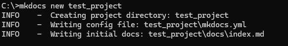
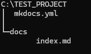
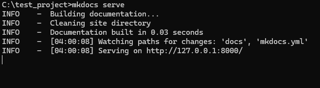
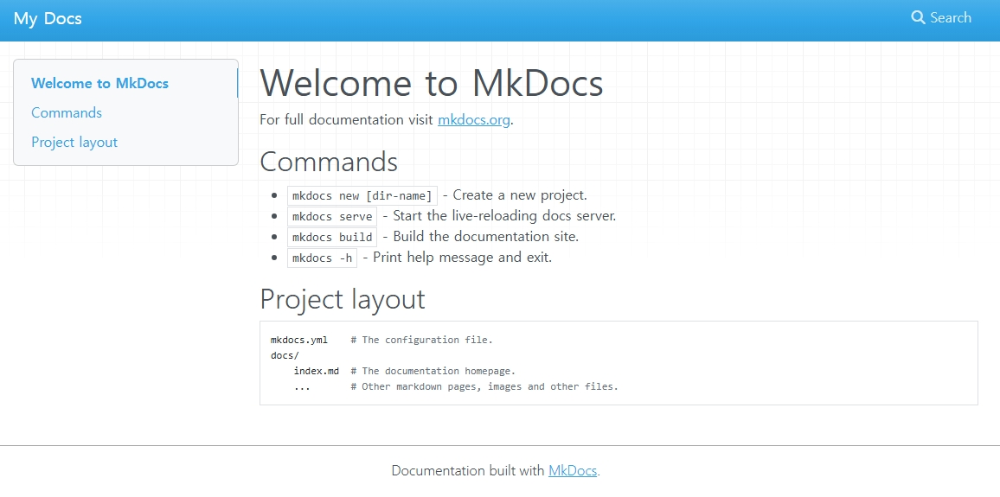
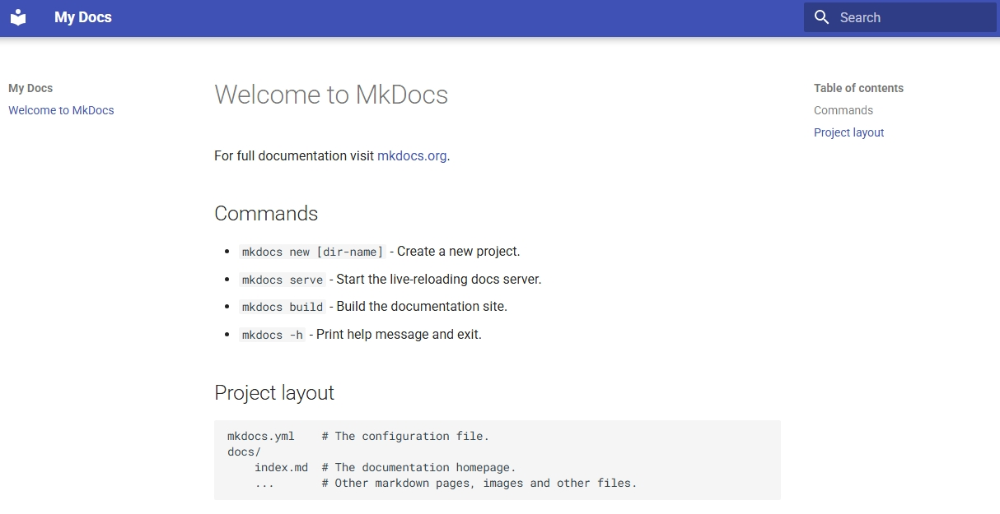
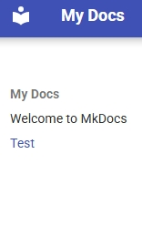
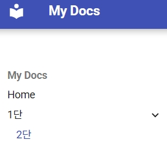

## 프로젝트 생성
### 방법1) 원하는 경로에 접근후 생성
```bash
mkdocs new test_project
```

### 방법2) 절대 경로로 생성
```bash
mkdocs new C:/test_project
```
### 프로젝트 생성 확인
  
## 서버 실행
서버실행시 기본값은 **localhost:8000**이다.
>ip 및 port를 변경하고 싶으면 -a 옵션을 추가하면 된다.  
```
mkdocs serve -a 127.0.0.1:8001
```
### 방법1) 프로젝트 경로로 접근후 실행
```bash
mkdocs serve
```

### 방법2) 절대 경로로 실행
```bash
mkdocs serve -f C:\test_project\mkdocs.yml
```
### 서버 실행 확인
[http://localhost:8000/](http://localhost:8000/)  


## Material for MkDocs 적용하기
```yaml
site_name: My Docs
```
*mkdocs.yml*파일을 열어보면, 위와 같을 것이다.  
Material for MkDocs는 한국어를 지원하므로 다음과 같이 작성하면 된다.
```yaml
site_name: My Docs
theme: 
  name: material
  language: ko
```



## 페이지 추가하기
### *.md파일 생성
프로젝트의 **docs**디렉터리 안에 **md**확장자 파일을 생성한다.  
예시로는 **test.md**파일을 생성했다.  


이미지와 같이 자동으로 메뉴에 추가되었음을 알 수 있다.
### 메뉴 편집
메뉴의 순서나 이름을 변경하고 싶으면 *mkdocs.yml*파일을 수정하면 된다.
```yaml
site_name: My Docs
theme: 
  name: material
  language: ko
nav:
  - Home: index.md
  - 테스트: test.md
```

다음과 같이 공백에 유의하여 작성하며, n단으로 이루어 지는 메뉴가 구성된다.
```yaml
nav:
  - Home: index.md
  - 1단: 
    - 2단: test.md
```
